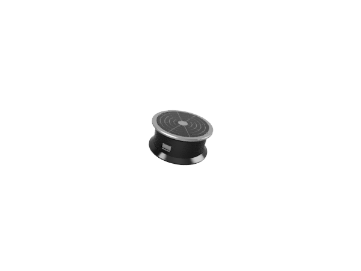
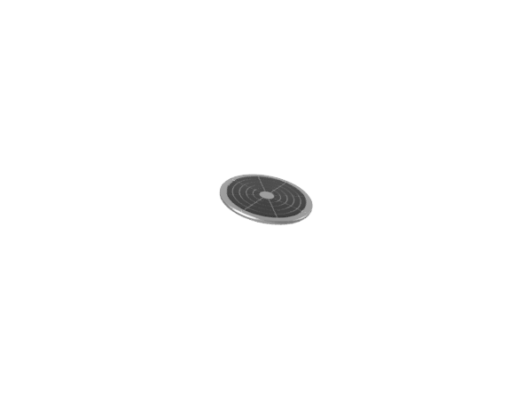
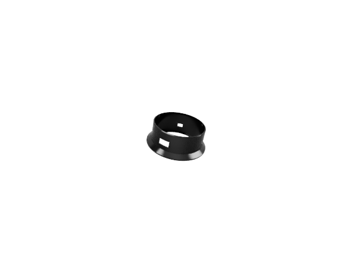
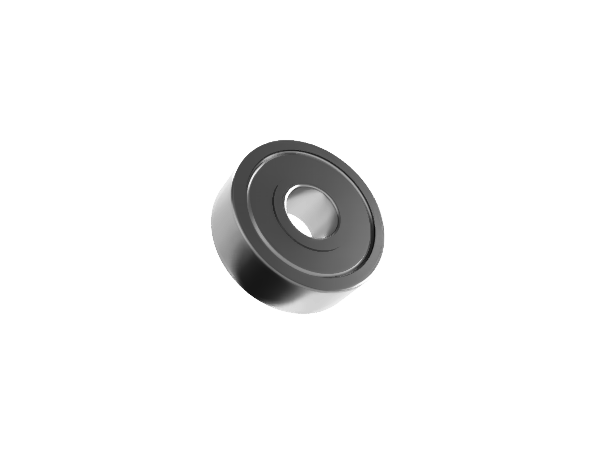
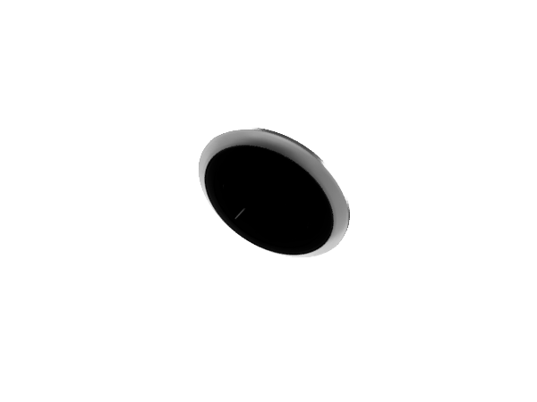
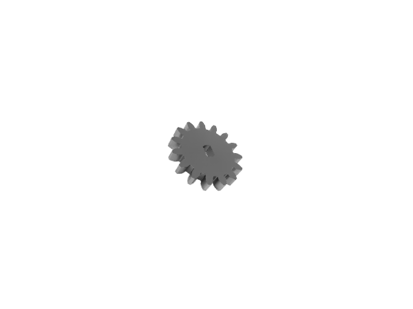
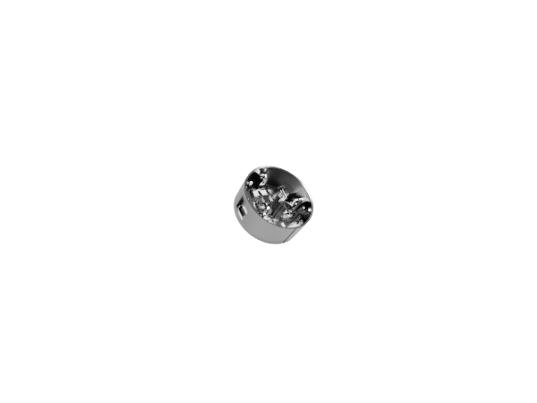

# 📸 ESP32-Based Turning Table for 3D Scanning

This project is a compact, gear-driven rotating table designed for 3D scanning, object photography, or automated product turntable use. The device is controlled via Bluetooth using a custom Android app, and supports configurable rotation direction, speed, and mode (one full turn or continuous).

---

## 📷 Rendered Views

| Component                        | View                             |
|----------------------------------|----------------------------------|
| Assembled view                   |  |
| Upper changeable plate (top)     |       |
| Outer area made with IRON PLA    |      |
| Bearing 604ZZ                    |         |
| Upper changeable plate (bottom)  |    |
| Small gear                       |            |
| Housing made with ABS            |         |
---
All parts is made with 3D printer QIDITECH X-3

## 🔌 ESP32 Pinout


```markdown
| ESP32 Pin | Function            | Connected To             |
|-----------|---------------------|---------------------------|
| GPIO27    | IN1 (stepper)       | ULN2003 IN1               |
| GPIO26    | IN2 (stepper)       | ULN2003 IN2               |
| GPIO25    | IN3 (stepper)       | ULN2003 IN3               |
| GPIO33    | IN4 (stepper)       | ULN2003 IN4               |
| GPIO16    | I2C SDA             | SSD1306 OLED Display      |
| GPIO17    | I2C SCL             | SSD1306 OLED Display      |
| 5V / GND  | Power               | Stepper, OLED, ULN2003    |
```

---

## 🔧 Hardware

The following electronic components were used to build the Turning Table:

| Component                      | Model / Type                      | Notes                                                |
|-------------------------------|-----------------------------------|------------------------------------------------------|
| Microcontroller               | ESP32-WROOM-32                    | DevKit board, dual-core with Bluetooth Classic       |
| Stepper Motor                 | 28BYJ-48 5V                       | 64 steps/rev, with internal 1:64 gear reducer        |
| Stepper Driver                | ULN2003                           | 4-channel Darlington array board                     |
| OLED Display                  | SSD1306 128x64                    | I2C, 0.96" screen, U8g2-compatible                   |
| Gear Set                      | Spur Gears 15T & 54T              | External 15 teeth, internal 54 teeth                 |
| Bearings                      | 604ZZ                             | 4x used for smooth rotation and support              |
| Power Supply                  | 5V via USB or battery             | Stepper and ESP32 powered from 5V rail              |
| Chassis                       | Custom 3D printed parts           | Includes housing, table platform, mounts            |
| Bluetooth Communication       | Built-in                          | Used for control via custom Android app             |

---

## ⚙️ Features

- Two rotation modes: **1 turn (T)** or **Continuous (C)**
- Adjustable speed: **1.0X to 5.0X**
- Direction control: **Clockwise (CW)** / **Counter-Clockwise (CCW)**
- OLED shows:
    - Mode / Direction / Speed
    - Bluetooth connection status
    - Animation that reflects rotation direction and speed
- Self-test sequence
- Fully controllable via Android app over Bluetooth

---

## 📡 Serial / Bluetooth Commands

```text
SetDirection CW      # Sets direction to clockwise
SetDirection CCW     # Sets direction to counter-clockwise
ModeRun T            # Sets mode to 1 turn
ModeRun C            # Sets mode to continuous
SetSpeed 3.0         # Sets speed (1.0 to 5.0)
Play or RotateStart  # Starts rotation
Stop                 # Stops rotation
SelfTest             # Starts self-diagnostic test
SendStatus           # Sends current status to serial/BT
```

---


---

© 2025. Built with ❤️ by [Žarko Vargović, Dubrava232, Zagreb, Croatia]
